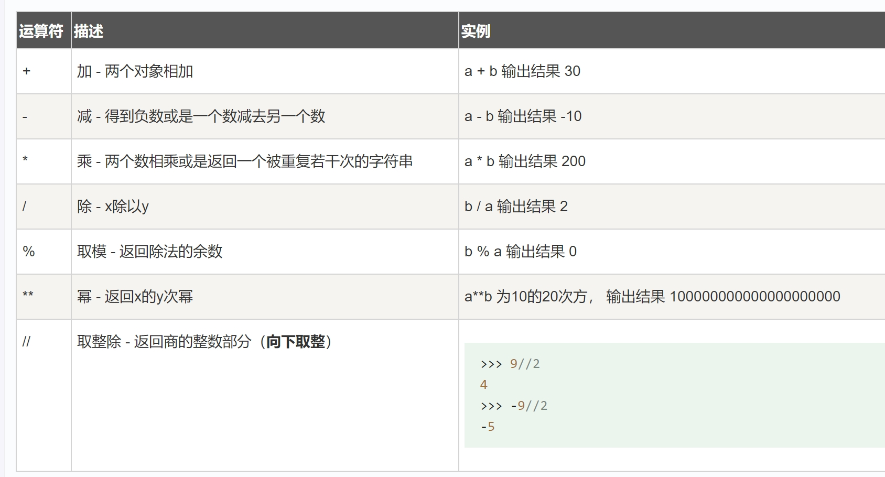
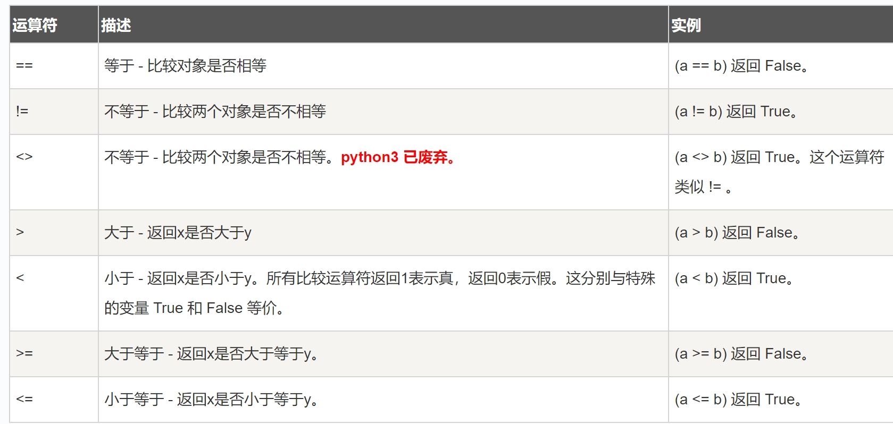
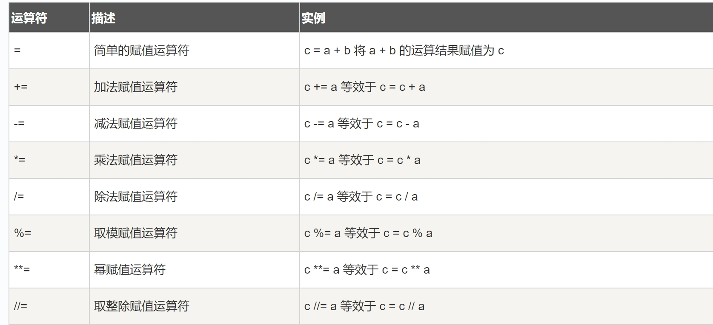
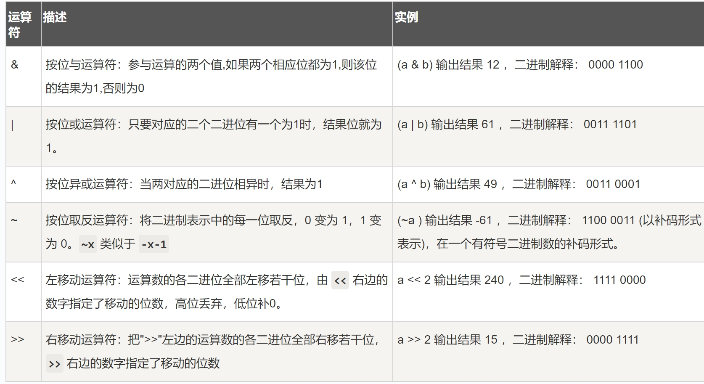
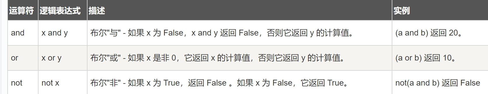
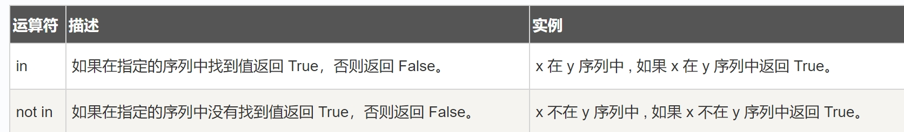
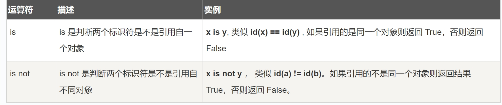
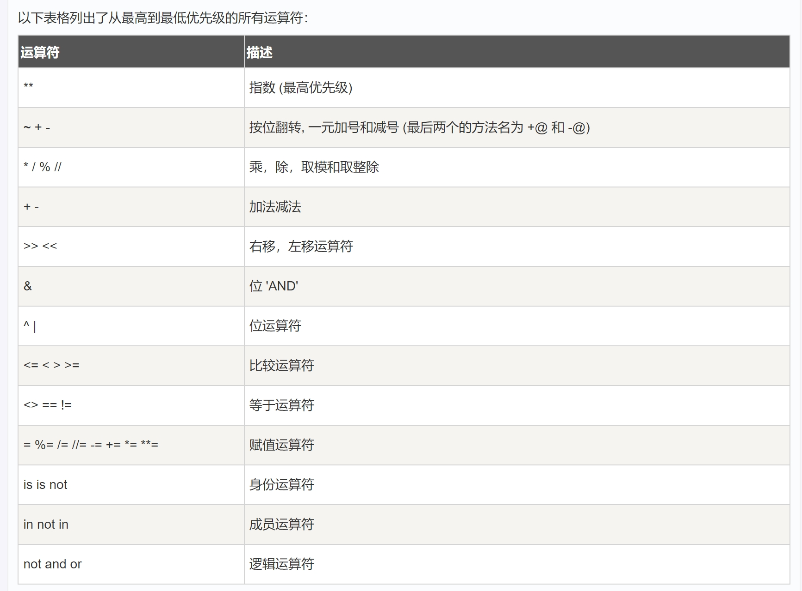

# Python 运算符
什么是运算符？
本章节主要说明Python的运算符。举个简单的例子 4 +5 = 9 。 例子中，4 和 5 被称为操作数，+ 称为运算符。

Python语言支持以下类型的运算符:

- 算术运算符
- 比较（关系）运算符
- 赋值运算符
- 逻辑运算符
- 位运算符
- 成员运算符
- 身份运算符
- 运算符优先级
  
  ---
### python算术运算符
假设变量 a=10 b=20;

~~~
#!/usr/bin/python
# -*- coding: UTF-8 -*-
 
a = 21
b = 10
c = 0
 
c = a + b
print "1 - c 的值为：", c
 
c = a - b
print "2 - c 的值为：", c 
 
c = a * b
print "3 - c 的值为：", c 
 
c = a / b
print "4 - c 的值为：", c 
 
c = a % b
print "5 - c 的值为：", c
 
# 修改变量 a 、b 、c
a = 2
b = 3
c = a**b 
print "6 - c 的值为：", c
 
a = 10
b = 5
c = a//b 
print "7 - c 的值为：", c
~~~
输出结果
~~~
1 - c 的值为： 31
2 - c 的值为： 11
3 - c 的值为： 210
4 - c 的值为： 2
5 - c 的值为： 1
6 - c 的值为： 8
7 - c 的值为： 2
~~~
==注意==：**Python2.x 里，整数除整数，只能得出整数。如果要得到小数部分，把其中一个数改成浮点数即可**
实例
~~~
>>> 1/2
0
>>> 1.0/2
0.5
>>> 1/float(2)
0.5
~~~
---
### python比较运算符
假设变量a=10,b=20:

运算符操作
~~~
#!/usr/bin/python
# -*- coding: UTF-8 -*-
 
a = 21
b = 10
c = 0
 
if  a == b :
   print "1 - a 等于 b"
else:
   print "1 - a 不等于 b"
 
if  a != b :
   print "2 - a 不等于 b"
else:
   print "2 - a 等于 b"
 
if  a <> b :
   print "3 - a 不等于 b"
else:
   print "3 - a 等于 b"
 
if  a < b :
   print "4 - a 小于 b" 
else:
   print "4 - a 大于等于 b"
 
if  a > b :
   print "5 - a 大于 b"
else:
   print "5 - a 小于等于 b"
 
# 修改变量 a 和 b 的值
a = 5
b = 20
if  a <= b :
   print "6 - a 小于等于 b"
else:
   print "6 - a 大于  b"
 
if  b >= a :
   print "7 - b 大于等于 a"
else:
   print "7 - b 小于 a"
~~~
输出结果
~~~
1 - a 不等于 b
2 - a 不等于 b
3 - a 不等于 b
4 - a 大于等于 b
5 - a 大于 b
6 - a 小于等于 b
7 - b 大于等于 a
~~~
### python赋值运算符

运算符操作
~~~
#!/usr/bin/python
# -*- coding: UTF-8 -*-
 
a = 21
b = 10
c = 0
 
c = a + b
print "1 - c 的值为：", c
 
c += a
print "2 - c 的值为：", c 
 
c *= a
print "3 - c 的值为：", c 
 
c /= a 
print "4 - c 的值为：", c 
 
c = 2
c %= a
print "5 - c 的值为：", c
 
c **= a
print "6 - c 的值为：", c
 
c //= a
print "7 - c 的值为：", c
~~~
输出结果
~~~
1 - c 的值为： 31
2 - c 的值为： 52
3 - c 的值为： 1092
4 - c 的值为： 52
5 - c 的值为： 2
6 - c 的值为： 2097152
7 - c 的值为： 99864
~~~
### python位运算符
按位运算符是把数字看作二进制来进行计算的。Python中的按位运算法则如下：

下表中变量 a 为 60，b 为 13，二进制格式如下
~~~
a = 0011 1100

b = 0000 1101

-----------------

a&b = 0000 1100

a|b = 0011 1101

a^b = 0011 0001

~a  = 1100 0011
~~~

位运算符操作如下
~~~
#!/usr/bin/python
# -*- coding: UTF-8 -*-
 
a = 60            # 60 = 0011 1100 
b = 13            # 13 = 0000 1101 
c = 0
 
c = a & b;        # 12 = 0000 1100
print "1 - c 的值为：", c
 
c = a | b;        # 61 = 0011 1101 
print "2 - c 的值为：", c
 
c = a ^ b;        # 49 = 0011 0001
print "3 - c 的值为：", c
 
c = ~a;           # -61 = 1100 0011
print "4 - c 的值为：", c
 
c = a << 2;       # 240 = 1111 0000
print "5 - c 的值为：", c
 
c = a >> 2;       # 15 = 0000 1111
print "6 - c 的值为：", c
~~~
以上实例输出结果
~~~
1 - c 的值为： 12
2 - c 的值为： 61
3 - c 的值为： 49
4 - c 的值为： -61
5 - c 的值为： 240
6 - c 的值为： 15
~~~
---
### python逻辑运算符
以下假设变量 a 为 10, b为 20

操作
~~~
#!/usr/bin/python
# -*- coding: UTF-8 -*-
 
a = 10
b = 20
 
if  a and b :
   print "1 - 变量 a 和 b 都为 True"
else:
   print "1 - 变量 a 和 b 有一个不为 True"
 
if  a or b :
   print "2 - 变量 a 和 b 都为 True，或其中一个变量为 True"
else:
   print "2 - 变量 a 和 b 都不为 True"
 
# 修改变量 a 的值
a = 0
if  a and b :
   print "3 - 变量 a 和 b 都为 True"
else:
   print "3 - 变量 a 和 b 有一个不为 True"
 
if  a or b :
   print "4 - 变量 a 和 b 都为 True，或其中一个变量为 True"
else:
   print "4 - 变量 a 和 b 都不为 True"
 
if not( a and b ):
   print "5 - 变量 a 和 b 都为 False，或其中一个变量为 False"
else:
   print "5 - 变量 a 和 b 都为 True"
   ~~~
   输出结果
   ~~~
   1 - 变量 a 和 b 都为 True
2 - 变量 a 和 b 都为 True，或其中一个变量为 True
3 - 变量 a 和 b 有一个不为 True
4 - 变量 a 和 b 都为 True，或其中一个变量为 True
5 - 变量 a 和 b 都为 False，或其中一个变量为 False
~~~
### python成员运算符
除了以上的一些运算符之外，Python还支持成员运算符，测试实例中包含了一系列的成员，包括字符串，列表或元组。

运算操作
~~~
#!/usr/bin/python
# -*- coding: UTF-8 -*-
 
a = 10
b = 20
list = [1, 2, 3, 4, 5 ];
 
if ( a in list ):
   print "1 - 变量 a 在给定的列表中 list 中"
else:
   print "1 - 变量 a 不在给定的列表中 list 中"
 
if ( b not in list ):
   print "2 - 变量 b 不在给定的列表中 list 中"
else:
   print "2 - 变量 b 在给定的列表中 list 中"
 
# 修改变量 a 的值
a = 2
if ( a in list ):
   print "3 - 变量 a 在给定的列表中 list 中"
else:
   print "3 - 变量 a 不在给定的列表中 list 中"
   ~~~
   输出结果
   ~~~
   1 - 变量 a 不在给定的列表中 list 中
2 - 变量 b 不在给定的列表中 list 中
3 - 变量 a 在给定的列表中 list 中
~~~
---
### python身份运算符
**作用**：用于比较两个对象的存储单元

==注： id() 函数用于获取对象内存地址。==
~~~
#!/usr/bin/python
# -*- coding: UTF-8 -*-
 
a = 20
b = 20
 
if ( a is b ):
   print "1 - a 和 b 有相同的标识"
else:
   print "1 - a 和 b 没有相同的标识"
 
if ( a is not b ):
   print "2 - a 和 b 没有相同的标识"
else:
   print "2 - a 和 b 有相同的标识"
 
# 修改变量 b 的值
b = 30
if ( a is b ):
   print "3 - a 和 b 有相同的标识"
else:
   print "3 - a 和 b 没有相同的标识"
 
if ( a is not b ):
   print "4 - a 和 b 没有相同的标识"
else:
   print "4 - a 和 b 有相同的标识"
   ~~~
   输出结果
   ~~~
   1 - a 和 b 有相同的标识
2 - a 和 b 有相同的标识
3 - a 和 b 没有相同的标识
4 - a 和 b 没有相同的标识
~~~
==注意：is 用于判断两个变量引用对象是否为同一个(同一块内存空间)， == 用于判断引用变量的值是否相等==
~~~
>>> a = [1, 2, 3]
>>> b = a
>>> b is a 
True
>>> b == a
True
>>> b = a[:]
>>> b is a
False
>>> b == a
True
~~~
### python运算符优先级

实例
~~~
#!/usr/bin/python
# -*- coding: UTF-8 -*-
 
a = 20
b = 10
c = 15
d = 5
e = 0
 
e = (a + b) * c / d       #( 30 * 15 ) / 5
print "(a + b) * c / d 运算结果为：",  e
 
e = ((a + b) * c) / d     # (30 * 15 ) / 5
print "((a + b) * c) / d 运算结果为：",  e
 
e = (a + b) * (c / d);    # (30) * (15/5)
print "(a + b) * (c / d) 运算结果为：",  e
 
e = a + (b * c) / d;      #  20 + (150/5)
print "a + (b * c) / d 运算结果为：",  e
~~~
输出结果
~~~
(a + b) * c / d 运算结果为： 90
((a + b) * c) / d 运算结果为： 90
(a + b) * (c / d) 运算结果为： 90
a + (b * c) / d 运算结果为： 50
~~~
